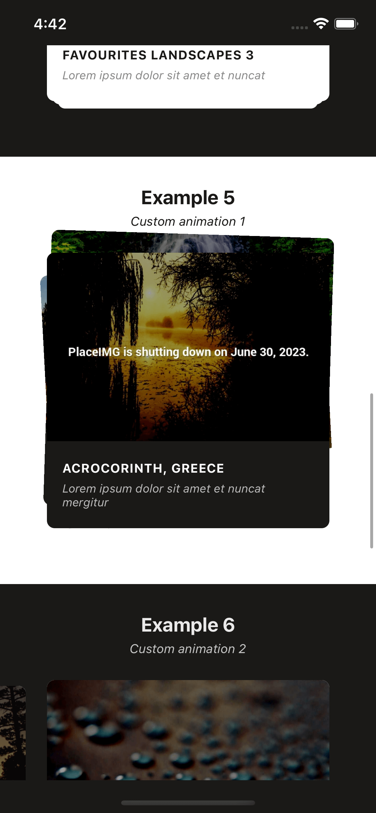
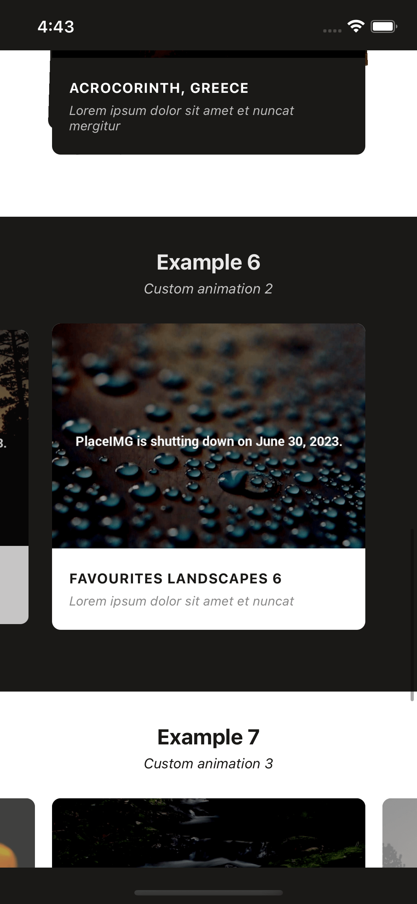

# Example and fix for the react-native-snap-carousel

## deprecated-react-native-prop-types

### ViewPropTypes will be removed from React Native. Migrate to ViewPropTypes exported from 'deprecated-react-native-prop-types

1. Step 1: npm install deprecated-react-native-prop-types or yarn add deprecated-react-native-prop-types.

2. Step 2: open all of these 4 files which is exists in the directories

`node_modules\react-native-snap-carousel\src\carousel\Carousel.js`
and

`node_modules\react-native-snap-carousel\src\pagination\Pagination.js`
and

`node_modules\react-native-snap-carousel\src\pagination\PaginationDot.js`
and

`node_modules\react-native-snap-carousel\src\parallaximage\ParallaxImage.js` 3. Step 3: delete all ViewPropTypes which is imported from react-native and import it from deprecated-react-native-prop-types which is the module we installed at the Step 1, and put it in a separated line like this

import { ViewPropTypes } from 'deprecated-react-native-prop-types'
Step 4: add this line "postinstall": "patch-package", in package.json in scripts section. example:

"scripts": {
"start": "expo start",
"postinstall": "patch-package"
},
Step 5: run this command npx patch-package react-native-snap-carousel.

Step 6: run this command npm run postinstall

# preview

| Landing                      | Home                         | Detail Page                  | Detail Page                  |
| ---------------------------- | ---------------------------- | ---------------------------- | ---------------------------- |
|  |  |  |  |
|  |  |  |  |
